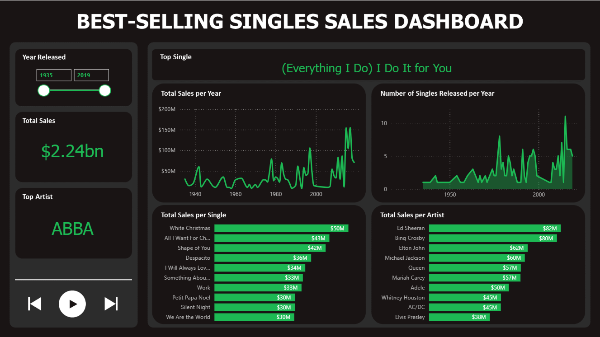

# Best-Selling Singles: Web Scraping and Power BI Dashboard



This project establishes a data pipeline to extract best-selling singles data from a specified url and load it into a PostgreSQL database. Power BI leverages this database to generate dynamic sales dashboards.

&nbsp;
## Features
- Extracts data from a specified URL ("List of best-selling singles")
- Transforms and cleans the extracted data
- Loads the data into a PostgreSQL database table named "Best Selling Singles"
      
&nbsp;
## Project Prerequisites
- Python 3.12.2
- Libraries:
  - requests
  - beautifulsoup4
  - pandas
  - re
  - sqlalchemy
  - os
  - dotenv
- PostgreSQL database
- A .env file containing database credentials (IMPORTANT: exclude this file from version control!)

&nbsp;
## Installation
1. Clone this repository.
```
https://github.com/cegjimenez/best-selling-singles.git
```

2. Create a virtual environment.
```
python -m venv venv
```

2. Activate the virtual environment.
```
venv\Scripts\activate # Windows
source venv/bin/activate  # Linux/macOS
```

4. Install required dependencies.
```
pip install -r requirements.txt
```

5. Run the script:
```
python main.py
```  
